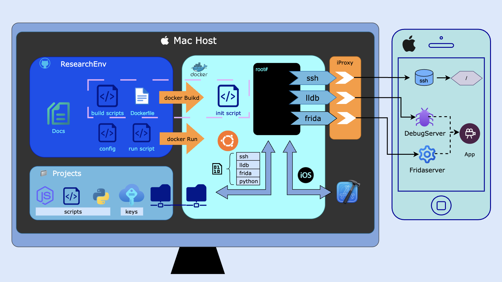

## General
iosEnv is a docker container for ios debugging and research
The idea is to move a mac research setup, script it and dockerise it  
It contains a quick setup for the following CLI tools 
- ssh    
- frida  
- lldb



(draw.io project of this chart is [here](./docs/env_pretty.drawio))

dockerfile is [here](./docker/Dockerfile)


## Goal
once everything is properly set up, you just need the following two lines:

To build   
```
$ ./build_and_run_docker
```
This ^ will also setup the needed ports   
and once inside the container   
```
# ./debug
```

and this should: set up ports, build the container, copy the needed secrets for passwordless interaction with a jailbroken physical device, copy the needed scripts, ssh into the device, look for the PID you want to hook/debug, run the tool you select (lldb/frida), connect the client to the server and the process, load and run the script   


## Terminology
Host - the computer that runs the docker (macOS)     
Container - the docker container with the research tools   


## Requirements
- A Jailbroken device with the openssh, fridaserver and debugserver installed
- A mac computer as the host (at least if you want ios symbols in lldb)   
- Setup of the folder heirarchy as needed (if you want full functionality)   
- Docker on your host (Docker Desktop)   


## Setup Instructions
This is a very important step since the docker relies on specific folder structure of the host   
The reason is to separate this public repo from your private projects and scripts   

### First step
Read the [blog post](https://chensokolovsky.github.io/FuzzerAmoreBlog/posts/ios_research_docker_env.html). It will help you understand many of the concepts and answer the "why"   


### Setup your host folder structures
The following folder structure is a vital part of making everything work as expected   

Needed folders (you can name them however you want, but just to understand their role):  
**projects** - a folder with your research projects materials. This may contain binaries, write ups, etc, but most importanly the scripts that are project-specific. for example: ```projects/mySpringboardResearch/my_springboard_lldb_script.py```  

**secrets** - a folder inside the projects folder that contains private key pairs and known hosts files for seemlessly connecting the container to the device (ssh, scp) without the need to enter the password manually  

**run.cfg** - a main config file that is located in the projects folder. It points to the current project folder (within the projects folder), the current configuration to run, and device related information. The contents of this file should change when you change projects, change a device, or change a research tool. Example: when working with lldb on a binary and wanting to switch to frida, while keeping the lldb configuration for later use  

Folders:  
```
iosEnv                            // This repo
projects                          // can be anywhere on the file system. define the path in iosEnv/config.cfg
|---- myProjectA                  // a project with files and scripts
|      |---- run_lldb.cfg         // a tool specific and script specific configuration file to run
|      |---- my_lldb_script.py    // a script to run with a tool (could be a frida script, frida-python, lldb)
|---- secrets                     // a folder with ssh key pairs
|---- scripts                     // a folder with genetic scripts to be loaded when lldb launched (configurable)
|---- run.cfg                     // a file pointing at the current project folder and the current run config
```


### Set the configuration
config.cfg - set the projects folder, scripts folder, etc   
run.cfg   
binary_tool.cfg (example, safari_lldb.cfg)   

  
### More reading in the docs  

For ports from docker to device see [here](./docs/ports_setup_doc.md)    
Environment structure guide [here](./docs/environment_structure.md)   
Checking live ports [here](./docs/check_live_ports.md)  


### Useful aliases  

Inside the container:  
```
# myssh
# myfrida
```
will save you the trouble of writing ```# ssh -p 4000 mobile@host.docker.internal``` etc    


### Troubleshooting  
On the host mac, you may need to approve some of the folders you are sharing with the container.  
Open Settings in the Docker Desktop GUI and allow access to the needed folders (projects, xcode, scripts)   

When using Frida, in most cases it is mandatory for the client version to be the same major version as the server version on the device. Change the Dockerfile to the frida-tools version that matches your server (note that frida-tools version != frida client version).   
Note that this is not the case with lldb, and that lldb we are using here is patched, so it is not recommended to change the lldb client version (much easier to change the debugserver version on the device in this case, plus, mismatching versions between client and server tend to work in lldb anyhow)


## License
[apache 2.0](./LICENSE)