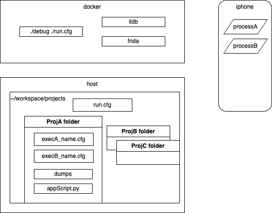

## Env Structure

One of the ideas behind the design of this env is that as a researcher, you may have some long term scripts that are stored in in a folder on the host (which could be a repo of scripts on its own) which you usually re-use in your researches
Another folder on the host is project specific, and contains sripts (like lldb-python or frida js) with breakpoints/hooks at specific symbols/addresses and connect to specific binaries as needed for your current project

In that sense, projects will change, and can not live in this folder/repo  
Tools may change between frida, lldb and perhaps others  
More than one executable may be deugged per project  

This leaves the need to be as flexible as possible
To handle this, here is the currently used degisn


Let's follow the ```examples/example_env``` of this repo

First you set up a ```projects``` folder on your host, which links to the ```/projects``` folder in your container (note that in the container this is in the root ```/```)
The projects folder will be set up once, and for every new project, you can add folders to it   

When working on a new project, let's say projectA, we might be working in a binary named ```clipboard``` 
It will have a name that can be used to get the PID, or to attach to it before starting to run.

A main ```run.cfg``` sits in the projects folder and points to the current project directory. The content of this file should change when you switch projects, change tools, change configuration, or even change a device between root and rootless jailbreaks 

Each project is saved in a dedicated folder on the host  
It ideally contains a configuration file for each researched executable/tool 
The configuration file may contain items like:  
process_name  
use_wait_for  
and more...  

### In addition:  
A frida and/or lldb scripts which are specific to the research  
A folder for dumping information  
Documentation of the research  

This folder can be then saved on a drive, or other storage, and the researcher can come back to it  

## Project Folder Structure

The container will point to a run.cfg file which sits in a host folder (example: ~/workspace/projects)

The run config will point to a project folder and an executable conf file

Example:

In the container
```
# ./debug /run.cfg
```
The debug script should handle scenarios from the config
Folder is shared between host and container in read/write modes


On the host
```
~/workspace/projects/run.cfg
```
This is shared with the container at
```
/projects/run.cfg
```

In the file
```
PROJECT_FOLDER="ProjectA"
RUN_CONF="lldb_example_waitfor.cfg"
MOBILE_USER="mobile"
DEBUGSERVER_PATH="/var/tmp/debugserver"
```

the script will look for the ```lldb_example_waitfor.cfg``` in the ```ProjectA``` folder and act accordingly.   
when using ```ssh``` or starting the lldb server on the device, the ```MOBILE_USER``` and ```DEBUGSERVER_PATH``` will be used respectively.   


The lldb_example_waitfor.cfg file contains running information. It sits in the project folder
Example:
```
$ cat ProjectA/lldb_example_waitfor.cfg
EXEC_FOLDER="clipboard"
EXEC_NAME="MobileSafari"
TOOL="lldb"
LLDB_WAITFOR="true"
LLDB_SCRIPT="clipboard_script.py"
```

## generic scripts
You might have some generic scripts that you want to load each time you launch lldb such as your custom commands and helpers.
To do this you can configure the ```LLDB_SCRIPTS``` as an array in the main config.cfg file of the repo. These scripts will be added to the lldbinit and loaded upon launching it.
example:
```
LLDB_SCRIPTS=("lldbsh.py" "lldbhelper.py")
```
Which assumes it can find these scripts in a the folder ```"$LLDB_SCRIPTS/lldb"```  (using the mount to ```/env/scripts/```)


## Passwordless SSH

The SSH should work as part of scripts, and therefore no dialogs and passwords prompts should interfere.

To do this, we follow the methods in these links [1](https://phoenixnap.com/kb/ssh-with-key), [2](https://www.digitalocean.com/community/tutorials/how-to-configure-ssh-key-based-authentication-on-a-linux-server) 

Once the key pair is generated it is copied to the projects folder, and copied to the container by the script  
Note the the public key should be copied to the device  
You can use ```scp``` to copy the file, or just copy patse the key to a new file using vim on the device  

Another important file is the known hosts file. Since the docker image is re-created, it needs to know the device as the known host (as the device is the ssh server) 

The private key and known host should be set in a ```secrets``` folder in the host's ```projects``` folder    
The [init](../docker/env/init) script will copy the keys as soon as the doker is run   
```
cp /projects/secrets/id_rsa /root/.ssh/
cp /projects/secrets/known_hosts /root/.ssh
```  
This should allow for immidiate ssh and/or debugging against the device with no password or dialogs  


