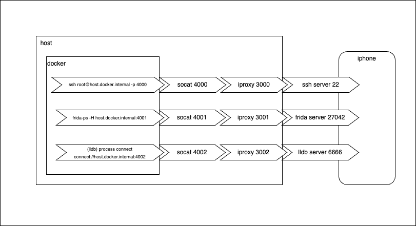

# Ports Setup Script

The script is setting up the needed iproxy and ports for working on the iOS device from within the container

to run:
```
$ ./set_up_ports
```
Make sure to see the ports in [config.cfg](../config.cfg)

Result should setup the port like this



Note: the ports in this guide are different from the ones in the configuration file

## Frida 
To work with Frida-ps, as the chosen example, some host setup is needed:
Frida uses default port 27042   
And once in the docker:
```
# frida-ps -H host.docker.internal:5556, which replaces localhost
```

However, some ports host setup needs to be made:
iProxy from the host to the device:
```
$ iproxy 5555 27042
```

Port forwarding from a chosen (host) port to the host port:
```
$ socat TCP-LISTEN:5556,fork TCP:localhost:5555
```
At this point, 5556 will be forwarded to 5555, which is proxied into the device's default Frida port


## ssh
----------------------------------------------
ssh to device works too, but with the same trick:
```
$ iproxy 2222 22
$ socat TCP-LISTEN:5557,fork TCP:localhost:2223
```
And in the docker:
```
# ssh root@host.docker.internal -p 5557
```
(or mobile for rootless)   

Note that installing ssh client was added to the docker file:
```
RUN apt-get install -y openssh-client
```

## lldb
------------------------------------------------

lldb
Same principle applies here too.
```
$ iproxy 6666 6666
$ socat TCP-LISTEN:6667,fork TCP:localhost:6666
```

on device:
```
$ ./debugserver localhost:6666 --attach=PID
```
in container:
```
$ lldb
(lldb) platform select remote-ios
(lldb) process connect connect://host.docker.internal:6667
```

-------------------------------------------------
